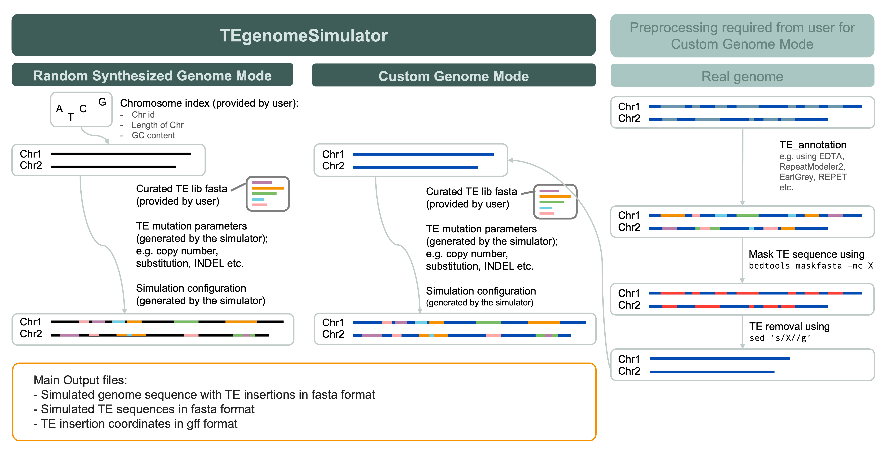

# TEgenomeSimulator
A tool to simulate TE mutation and insertion into a random-synthesised or user-provided genome.

This tool is under a MIT license with the goal to promote the advancement in TE research. You are welcome to raise issues for enquries regarding TEgenomeSimulator or contribure to the development / improvement of it. For details please check out [Contributing Guidline](./.github/contributing_guide.md).


## Introduction
TEgenomeSimulator was created based on [Matias Rodriguez & Wojciech Makałowski. Software evaluation for de novo detection of transposons. 2022 Mobil DNA](https://mobilednajournal.biomedcentral.com/articles/10.1186/s13100-022-00266-2). The original scripts were from [denovoTE-eval](https://github.com/IOB-Muenster/denovoTE-eval). Some existing functions were modified and several new functions were created for TEgenomeSimulator. The following table shows the major features that were kept, modified, or created in TEgenomeSimulator.

| Features | denovoTE-eval | TEgenomeSimulator |
|:---------|:-------------:|:-----------------:|
| Random synthesized genome |  O  |  O  |
| Custom genome |  X  |  O  |
| Simulation with multiple chromosomes |  X  |  O  | 
| Automatic generation of TE mutation parameter table<sup>a</sup> |  X  |  O  |
| Automatic generation of configuration yml file<sup>a</sup> |  X  |  O  |
| TE mutation: copy number<sup>b</sup> |  O  |  O (simplified)  |
| TE mutation: substitution rate |  O  |  O  |
| TE mutation: INDEL rate |  O  |  O  |
| TE mutation: standard deviation of SNP |  O  |  O  |
| TE mutation: 5' fragmentation |  O  |  O  |
| TE mutation: target site duplication (TSD)<sup>c</sup> |  O  |  O (enhanced)  |
| TE mutation: strandedness |  O  |  O  |
| TE gff file: TE coordinates |  O  |  O  |
| TE gff file: TE family  |  O  |  O  |
| TE gff file: TE superfamily if provided in TE lib fasta file<sup>d</sup> |  X  |  O  |
| TE gff file: TE subclass if provided in TE lib fasta file<sup>d</sup> |  X  |  O  |
| TE gff file: nucleotide identity info |  O  |  O  |
| TE gff file: fragmentation info |  O  |  O  |
| TE gff file: coordinates of disruption if TE cut by nested TE |  O  |  O  |
| TE gff file: tag to show if TE nested in other TE  |  O  |  O  |
| TE gff file: ID of associated nested/disrupted TEs  |  X  |  O  |

<sup>a</sup> denovoTE-eval requires user to provide a configuration file and a TE mutation parameter table with information such as copy number, nucleotide identity, fragmentation, TSD etc., whereas TE genomeSimulator automatically helps user to create these files.

<sup>b</sup> denovoTE-eval requires user to specify the copy number of each TE family in the TE mutation parameter table, whereas TEgenomeSimulator only requires user to specify a range of integer values where the copy number of each TE family would be randomly sampled. 

<sup>c</sup> denovoTE-eval allows user to specify whether to simulate TSD using y|n with the length of TSD randomly picked between the range of 5 and 20, whereas TEgenomeSimulator tries to recognise the TE family information from the sequence headers in TE library fasta file and then decides on the TSD length based on literature. For example, TEgenomeSimulator would set "5" as the TSD length of a Copia LTR-retrotransposon but "8-9" for Mutator DNA transposon. You can check the code of [prep_sim_TE_lib.py](TEgenomeSimulaot/utils/prep_sim_TE_lib.py) for more details about TSD length setting.

<sup>d</sup> To allow TEgenomeSimulator to include TE superfamily and class/subclass information in the final TE gff file, please follow the header format `>{TE_family}#{TE_subclass}/{TE_superfamily}`, such as `>ATCOPIA10#LTR/Copia`.

### TEgenomeSimulator flowchart


### Run modes
TEgenomeSimulator has two modes to be specified by user using the argument `-M` or `--mode`:
1) `-M 0` or`--mode 0`: **Random Synthesized Genome Mode**. This mode synthesizes a random genome with multiple chromosomes that are later inserted with TEs randomly. With this mode, user must use `-c` or `--chridx` to provide a chromosome index csv file in the formate of the file [rabdin_genome_chr_index.csv](./test/input/random_genome_chr_index.csv), which contains 3 columns separated by commas, representing the desired chromosome id, chromosome length, and GC content.
2) `-M 1` or`--mode 1`: **Custom Genome Mode**. It utilises a user-provided genome containing multiple chromosomes where TE bases had been removed, providing a customised genome canvas for random TE insertion. When this mode is enabled, the user must use `-g` or `--genome` to provide a genome fasta file, e.g. [Dondhond.chromosomes.only.fa.nonTE.2chrs](./test/input/Donghong.chromosomes.only.fa.nonTE.2chrs.gz), which contains TE-depleted chromosome 1 and 2 from the published [_Actinidia chinensis_ var. 'Donghong'](https://doi.org/10.1016/j.molp.2022.12.022). In this fasta file, the TE sequences on the original chromosome 1 and 2 have been detected and removed. 

### Other required input files/information
- `-p` or `--prefix`: a prefix for your simulation
- `-r` or `--repeat`: a fasta file containing TE family sequences (i.e. a TE library) to be mutated and then inserted into genome. The TE lib in our test [combined_curated_TE_lib_ATOSZM_selected.fasta](./test/input/combined_curated_TE_lib_ATOSZM_selected.fasta.gz) was created by concatenating TE library from a) _Arabidopsis thaliana_, b) _Oryza sativa_, and c) _Zea maize_ before using bbmap2 to remove exact duplicates and using CDHIT to generate a non-redundat TE lib for simulation test. The _A. thaliana_ and _Z. maize_ TE libraries were obtained from [EDTA repo (Ou et al. 2019)](https://github.com/oushujun/EDTA/tree/master/database) and the _O. sativa_ TE library was from [RepeatModeller2 (Flynn et al. 2020)](https://github.com/jmf422/TE_annotation/tree/master/benchmark_libraries/RM2).
- `-m` or `--maxcp`: an interger representing the maximum copy to be simulated for a TE family
- `-n` or `--mincp`: an integer representing the minimum copy to be simulated for a TE family
- `-c` or `--chridx`: the chromosome index file if **Random Synthesized Genome Mode** (`--mode 0`) is enabled. See the previous section **Run modes**.
- `-g` or `--genome`: the genome fasta file if **Custom Genome Mode** (`--mode 1`) is enabled. See the previous section **Run modes**.
- `-s` or `--seed`: an integer to specify the seed value. Default is 1.
- `-o` or `--outdir`: the path to the output directory

### Two steps
1) **Step 1**: The first step of TEgenomeSimulator is to perform non-overlap random TE insertion into the random synthesized or custom genome sequence.
2) **Step 2**: The second step is to perform nested TE insertion.

### Output files from TEgenomeSimulator
- **TElib_sim_list.table**: A tab-delimited table storing the parameters for simulating TE mutation. See example at ./test/output/ 
- **TEgenomeSimulator_{$prefix}.yml**: A configuration file for simulation. See example at ./test/output/
- **{$prefix}_genome_sequence_out.fasta**: The simulated genome fasta file with non-overlap random TE insertion (from **Step 1**).
- **{$prefix}_"_repeat_sequence_out.fasta**: The simulated TE sequences that had been inserted into the genome (from **Step 1**).
- **{$prefix}_repeat_annotation_out.gff**: The coordinates of inserted TE after non-overlap random TE insertion (from **Step 1**).
- **{$prefix}_genome_sequence_out_final.fasta**: The final simulated genome fasta file with non-overlap and nested random TE insertion (from **Step 2**).
- **{$prefix}_repeat_sequence_out_final.fasta**: The final simulated TE sequences, including the nested TEs that had been inserted into the genome (from **Step 2**).
- **{$prefix}_repeat_annotation_out_final.gff**: The final coordinates of all inserted TE adjusted after nested TE insertion (from **Step 2**)
- **TEgenomeSimulator.log**: The log file of the simulation.


## Installation steps
### 1. Clone this repo
```bash
cd $MYDIR
git clone git@github.com:PlantandFoodResearch/TEgenomeSimulator.git
```

### 2. Navigate to the cloned folder and install
```bash
cd TEgenomeSimulator
pip install .
```

### 3. Usage
After installation, you can take a look at the arguments of TEgenomeSimulator by typing `tegnomesimulator --help`. 
```text
usage: tegenomesimulator [-h] -M {0,1} -p PREFIX -r REPEAT -m MAXCP -n MINCP [-c CHRIDX] [-g GENOME] [-s SEED] -o OUTDIR

main arguments of TEgenomeSimulator to simulate TE mutation and insertion into genome.

optional arguments:
  -h, --help            show this help message and exit
  -M {0,1}, --mode {0,1}
                        Mode for genome simulation (either 0 or 1).
  -p PREFIX, --prefix PREFIX
                        Prefix for output files.
  -r REPEAT, --repeat REPEAT
                        TE family fasta file.
  -m MAXCP, --maxcp MAXCP
                        Maximum copies of TE family.
  -n MINCP, --mincp MINCP
                        Minimum copies of TE family.
  -c CHRIDX, --chridx CHRIDX
                        Chromosome index file if mode 0 is selected.
  -g GENOME, --genome GENOME
                        Genome fasta file if mode 1 is selected.
  -s SEED, --seed SEED  Random seed (default is 1).
  -o OUTDIR, --outdir OUTDIR
                        Output directory.
```

## Run TEgenomeSimulator using test data
### Random Synthesized Genome Mode 
```bash
cd TEgenomeSimulator
prefix=test_random
chridx="../test/input/random_genome_chr_index.csv" 
repeat="../test/input/combined_curated_TE_lib_ATOSZM_selected.fasta"
max=5
min=1
outdir="../test/output"
mkdir -p $outdir

python3 tegenomesimulator.py -M 0 -p $prefix -c $chridx -r $repeat -m $max -n $min -o $outdir
```

### Custom Genome Mode
```bash
cd TEgenomeSimulator
prefix=test_custom
genome="../test/input/Donghong.chromosomes.only.fa.nonTE.2chrs"
repeat="../test/input/combined_curated_TE_lib_ATOSZM_selected.fasta"
max=5
min=1
outdir="../test/output"
mkdir -p $outdir

python3 tegenomesimulator.py -M 1 -p $prefix -g $genome -r $repeat -m $max -n $min -o $outdir
```

## References:
- [Matias Rodriguez & Wojciech Makałowski. Software evaluation for de novo detection of transposons. 2022 Mobil DNA](https://mobilednajournal.biomedcentral.com/articles/10.1186/s13100-022-00266-2)
- [denovoTE-eval: https://github.com/IOB-Muenster/denovoTE-eval](https://github.com/IOB-Muenster/denovoTE-eval)
- [Ou et al. Benchmarking transposable element annotation methods for creation of a streamlined, comprehensive pipeline. 2019 Genome Biology](https://genomebiology.biomedcentral.com/articles/10.1186/s13059-019-1905-y)
- [Flynn et al. RepeatModeler2 for automated genomic discovery of transposable element families. 2020 PNAS](https://doi.org/10.1073/pnas.1921046117)

## Credits, Funding and Acknowledgement
- **Original Development**: TEgenomeSimulator was originally scripted by Ting-Hsuan Chen @ting-hsuan-chen.
- **Funding and Leadership** This work is part of the Kiwifruit Royalty Investment Programme (KRIP)-funded _Genome Landscape_ objective, led by Susan Thomson @cflsjt.
- **Reviewing and Testing**: Special thanks to Olivia Angeline-Bonnet @oliviaAB for reviewing and testing TEgenomeSimulator, and to Cecilia Deng @CeciliaDeng for additional review efforts.
- **Team Contributions**: We appreciate all the advice and comments from The New Zealand Institute for Plant and Food Research Limited Bioinformatics Analysis and Bioinformatics Engineering Teams.


## Citations
If you use TEgenomeSimulator for your work, please cite it as:
> **TEgenomeSimulator: A tool to simulate TE mutation and insertion into a random-synthesised or user-provided genome.** \
> Ting-Hsuan Chen, Olivia Angeline-Bonnet, Cecilia Deng, Susan Thomson \
> zenodo. 2024. doi: (TBC)
